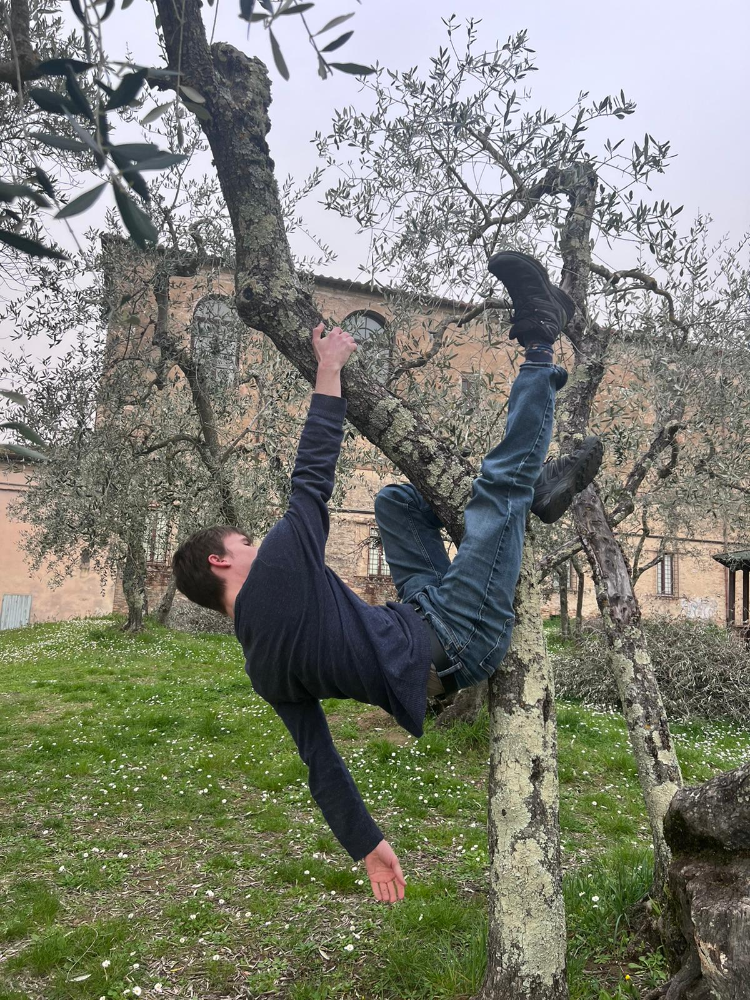

# Welcome to My Portfolio

My name is Paul Boardman, and I'm focused on creative expression and unorthodox intuition in the age of AI and our hypertechnical society. I strongly believe that we need to shine light on the black box of our psyche to understand our technology. I am an enthusiast of marginalia without defined margins, and of intellectual expression that makes an economy of its own entropy. Here you can find my projects, writeups, and miscellaneous endeavours.
